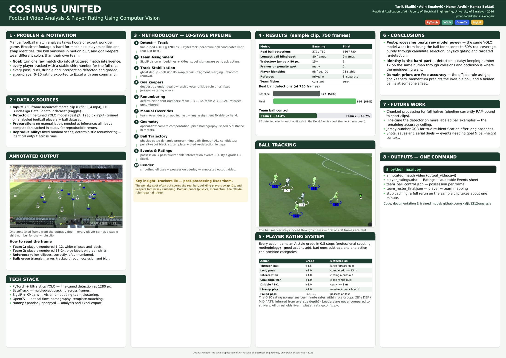
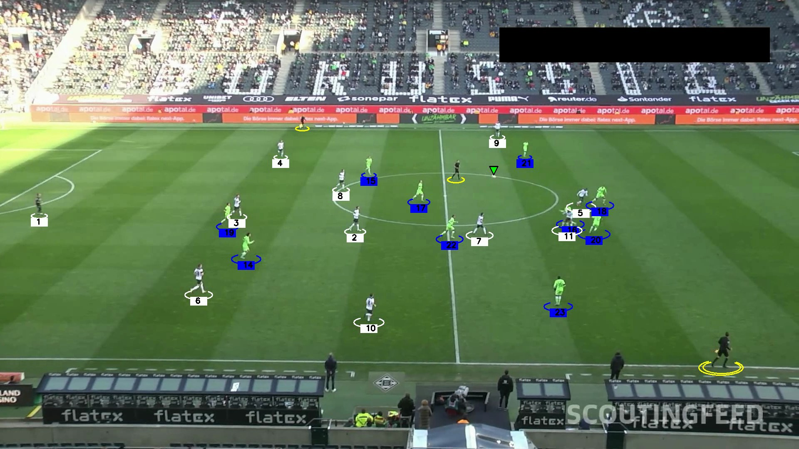
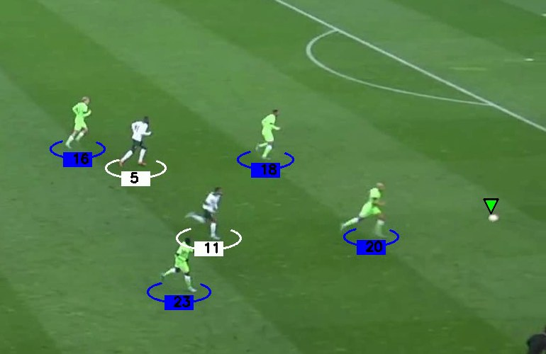
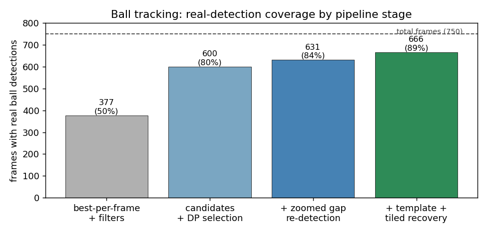
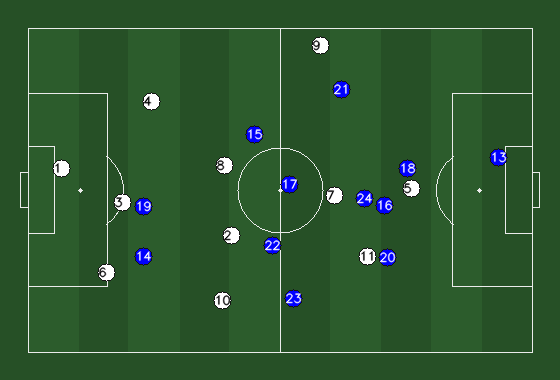
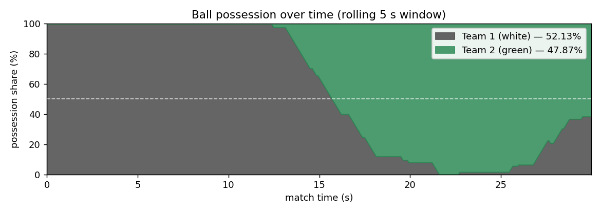
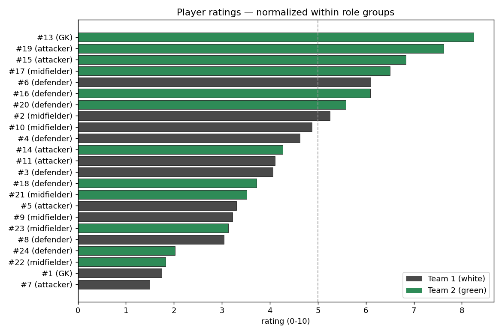

<div align="center">

# ⚽ Cosinus United

### Football Video Analysis & Player Rating Using Computer Vision

*Practical Application of AI (PAAI) — University of Sarajevo*


</div>

<div align="center">



</div>

---

## 🎯 Overview

**Cosinus United** is a complete, end-to-end computer vision system that turns a raw football match clip into **structured match intelligence**: every player tracked with a stable shirt number, both teams identified, the ball followed through occlusion and motion blur, every pass / duel / dribble detected — and finally a **per-player rating exported to Excel**, graded with professional scouting categories.

> 🥅 **Goal:** Replace hours of manual match analysis with one command — `python main.py` — that produces an annotated video and a ready-to-use player rating sheet.

<div align="center">



*Annotated output — team-colored ellipses with stable numbers (white team 1–12, green team 13–24), referees unnumbered, ball marker in green.*

</div>

---

## ✨ Key Features

| Feature | Description |
|---|---|
| **Detection + Tracking** | Fine-tuned YOLO at 1280px + ByteTrack, with stub caching for instant reruns |
| **Team Assignment** | SigLIP vision embeddings + KMeans, collision-aware voting, automatic goalkeeper correction |
| **Stable Identities** | Ghost-track removal, collision ID-swap repair, fragment merging — numbers persist for scoring |
| **Ball Trajectory** | Full candidate sets, penalty-spot blacklist, physics-gated path selection, template tracking, tiled re-detection |
| **Event Detection** | Passes (short/long/through), challenges, pressure, interceptions, link-up play, dribbles |
| **Player Ratings** | A-style accumulated grades (+/− per action) and a role-normalized 0–10 rating, exported to **Excel** |
| **Tactical Map** | Top-down formation chart of average player positions, goalkeeper-anchored self-calibration |
| **Manual Overrides** | `team_overrides.json` — fix any team assignment by hand, applied on top of everything |
| **Match Data Export** | Per-frame possession, team ball control %, definitive player→team roster (JSON) |

---

## 🚀 Quick Start

```bash
# 1. Install dependencies (Python 3.10+)
pip install -r requirements.txt

# 2. Download the large files (links below) and place them:
#    models/best.pt            <- trained YOLO model
#    input_videos/08fd33_4.mp4 <- sample match clip

# 3. Run the full pipeline
python main.py
```

**Everything heavy is cached in `stubs/`** (and the caches for the sample clip ship with this repo), so runs take about a minute. Only a *brand-new* video pays the one-time detection cost (~1 h on CPU, minutes on a GPU) — after that it's cached too.

### 📥 Download large files (GitHub size limits)

| File | Size | Link |
|---|---|---|
| `models/best.pt` — trained YOLO model | 186 MB | [Google Drive](https://drive.google.com/file/d/1BahaQ-U5Wxkmz9xcK5NRn4koFpV-tbya/view?usp=sharing) |
| `input_videos/08fd33_4.mp4` — sample clip | 19 MB | [Google Drive](https://drive.google.com/file/d/1S80r2fIoa7ZjSjPaWZqK3G5RcZ4tek8H/view?usp=sharing) |
| `output_videos/output_video.avi` — example result | 66 MB | [Google Drive](https://drive.google.com/file/d/1l0kfQ4lQmeCzMUytLLbtZkYfzBRH_Y14/view?usp=sharing) |

### 📦 Outputs

| File | Content |
|---|---|
| `output_videos/output_video.avi` | annotated match video |
| `output_videos/player_ratings.xlsx` | **Ratings** sheet + **Events** audit sheet |
| `output_videos/player_ratings.csv` | ratings table as CSV |
| `output_videos/team_ball_control.json` | possession % and per-frame team in possession |
| `stubs/team_roster_final.json` | definitive player number → team mapping |

---

## 🔬 Pipeline

```
input video
   ├─ 1. Detect + track ......... YOLO @1280px + ByteTrack          [cached]
   ├─ 2. Team assignment ........ SigLIP embeddings + KMeans,
   │                              collision-aware voting             [cached]
   ├─ 3. Track stabilization .... ghost dedup · ID-swap repair ·
   │                              fragment merging · phantom removal
   ├─ 4. Goalkeepers ............ position detection + deepest-
   │                              defender goal-ownership vote
   ├─ 5. Renumbering ............ team 1 → 1-12, team 2 → 13-24
   ├─ 6. Manual overrides ....... team_overrides.json
   ├─ 7. Geometry ............... camera motion, pitch homography,
   │                              speed & distance
   ├─ 8. Ball trajectory ........ candidates → blacklist → DP path →
   │                              zoomed/tiled/template recovery     [cached]
   ├─ 9. Events & ratings ....... possession → events → grades → Excel
   └─ 10. Render ................ smoothed ellipses → output video
                                  + top-down formation map
```

### 💡 Key Insight — trackers lie, post-processing fixes them

Three problems no off-the-shelf tracker solves out of the box, and how we solved them:

- **The penalty spot out-scores the ball.** YOLO regularly gives the painted spot *higher confidence* than the real ball. Keeping only the best detection per frame loses the ball permanently — so we keep **all** candidates and select the physically consistent path through them with dynamic programming.
- **Colliding players swap identities.** ByteTrack hands each player the other's ID after a collision. We detect the mirrored mid-track team flips and swap the underlying track data back — each number stays on one player for the whole match.
- **Goalkeepers fool jersey clustering.** Keepers wear different colors than their own team, so color/embedding methods always misassign them. Instead, the deepest outfield player at each goal (the offside rule guarantees that's a defender) votes for which team owns that goal.

<div align="center">



*The ball marker stays locked through chases — 666 of 750 frames are real detections, the rest are momentum-predicted and anchored to players' feet.*

</div>

---

## 📊 Results (sample clip, 750 frames)

| Metric | Naive baseline | Final system |
|---|:---:|:---:|
| Real ball detections | 377 / 750 | **666 / 750 (89%)** |
| Longest ball blind-spot | 80 frames | **9 frames (~⅓ s)** |
| Trajectory jumps > 80 px | 15+ | **1** |
| Frames stuck on penalty spot | many | **0** |
| Player identities | 98 fragmented IDs | **23 stable IDs** (11 + 12, one known split) |
| Referees | mixed into teams | **3, correctly unnumbered** |
| Team assignment flicker | constant | **zero** (one team per player per match) |

<div align="center">



*Each pipeline stage recovers more of the ball — from 50% with naive best-per-frame filtering to 89% real detections.*

</div>

Team ball control on the sample clip: **52.1% vs 47.9%**, with 26 detected events fully auditable in the Excel **Events** sheet (frame number + timestamp each).

<div align="center">



*Average player positions projected onto a top-down pitch — keepers 1 and 13 anchor the projection at their goals.*

</div>

<div align="center">



*Possession over time — white dominates the opening build-up, green takes over mid-clip.*

</div>

---

## 🏅 Player Rating System

Every action earns an A-style grade in 0.5 steps — good actions add, bad subtract, one action can combine categories (professional scouting methodology):

| Category | Grade | Detected as |
|---|:---:|---|
| Short pass | +0.5 | completed pass < ~13 m |
| Long pass | +1.0 | completed pass ≥ ~13 m |
| Through ball | +1.5 | large forward gain toward the opponent goal |
| Under pressure | +0.5 | bonus — opponent at the ball during the pass |
| Failed pass | −0.5 / −1.0 | possession lost via a traveled ball |
| Intercept | +1.0 | cutting that pass out (always standalone) |
| Challenge won / lost | +1.0 / −0.5 | close-range duel (scrambles merge into one) |
| Won in own third | +0.5 | bonus — defensive-zone ball win |
| Pressure | +0.5 | forcing the holder into an error |
| Close control | +0.5 | clean reception kept under pressure |
| Link up | +1.0 | receive under pressure + quick lay-off |
| Dribble / att 1v1 | +1.0 | carrying the ball ≥ ~8 m in one spell |
| Pace (sprint) | +0.25 | > 20 km/h sustained |

The **0–10 rating** normalizes per-minute rates (points, pass accuracy, challenge win rate, distance, sprints) **within role groups** — GK / defender / midfielder / attacker, inferred from average depth — so keepers are never compared to strikers and short appearances aren't punished.

<div align="center">



*Final ratings for the sample clip — every bar traces back to graded, frame-stamped events in the Excel sheet.*

</div>

> ⚙️ Every grade value, weight, and threshold lives in [`player_rating/config.py`](player_rating/config.py). Set `debug=True` in `main.py` to print every event with its frame number for manual verification.

### 🔧 Fixing mistakes by hand

[`team_overrides.json`](team_overrides.json) is applied last and wins over everything:

```json
{
  "player_teams": { "17": 1 },   // force player 17 (video number) to team 1
  "swap_goalkeepers": true        // flip both keepers at once
}
```

---

## 📁 Project Structure

```
analysis/
├── main.py                        ← pipeline orchestration
├── trackers/
│   ├── tracker.py                 ← YOLO+ByteTrack, ball trajectory, drawing
│   └── track_stabilizer.py        ← dedup, swap-fix, merging, renumbering
├── team_assigner/
│   ├── team_assigner_siglip.py    ← SigLIP embedding team classification
│   ├── team_assigner.py           ← color-clustering fallback
│   ├── team_roster.py             ← persistent player→team roster
│   ├── goalkeeper.py              ← GK detection + goal-ownership vote
│   └── occlusion.py               ← collision-frame detection
├── player_rating/
│   ├── config.py                  ← ALL grades, weights, thresholds
│   ├── possession.py              ← smoothed per-frame possession
│   ├── events.py                  ← pass/duel/dribble/link-up detection
│   ├── movement.py                ← distance, sprints (pitch meters)
│   ├── rating.py                  ← points, roles, 0-10 rating
│   └── export.py                  ← Excel/CSV export
├── pitch_map/                     ← top-down player map (formation chart)
├── camera_movement_estimator/     ← optical-flow camera compensation
├── view_transformer/              ← pixel → pitch-meter homography
├── speed_and_distance_estimator/  ← per-player speed & distance
├── player_ball_assigner/          ← ball-to-player assignment
├── utils/                         ← video & bbox helpers
├── training/                      ← notebook used to train models/best.pt
├── stubs/                         ← cached computation (ships with repo)
├── assets/                        ← README images & generated maps
├── poster/                        ← project poster
└── requirements.txt
```

---

## ♻️ Reproducibility

- ✅ Deterministic stabilization & renumbering — reruns produce identical player numbers
- ✅ All heavy computation cached in `stubs/` and shipped with the repo
- ✅ Fixed random seeds in clustering (KMeans `random_state=0`)
- ✅ Every detected event traceable to a frame number in the Events sheet

---

## 🧭 Conclusions & Future Work

**What we learned:**
- **Post-processing beats raw model power** — the same YOLO model went from losing the ball for seconds to 89% real coverage purely through candidate selection, physics gating, and targeted re-detection.
- **Identity is the hard part** — detection is easy; keeping number 17 on the same human for 750 frames through collisions and occlusion is where the real engineering went.
- **Domain priors are free accuracy** — the offside rule assigns goalkeepers, momentum predicts the invisible ball, and "a hidden ball is at someone's feet" fixes wandering markers.

**Next steps:**
- 🎥 Longer footage — chunked processing for full halves (the current pipeline is RAM-bound to short clips)
- 🔍 Fine-tune the detector on its own failures — [`tools/export_ball_dataset.py`](tools/export_ball_dataset.py)
  exports a self-labeled YOLO dataset (335 auto-labeled frames + the 84 known
  failure frames for manual ball boxes) with ready-to-run Colab instructions
- 👕 Jersey-number OCR for true re-identification after long absences
- 🥅 Shots, saves, aerials — event types needing goal & ball-height context

---

## 📚 References & Sources

- **Match clip & training data:** [DFL Bundesliga Data Shootout](https://www.kaggle.com/competitions/dfl-bundesliga-data-shootout) (Kaggle) — the sample clip (`08fd33_4.mp4`) and the footage used to fine-tune `models/best.pt` (see [`training/`](training/))
- **Detection:** [Ultralytics YOLO](https://github.com/ultralytics/ultralytics) — object detection framework; custom model fine-tuned for players, referees and ball
- **Tracking:** Zhang et al., [*ByteTrack: Multi-Object Tracking by Associating Every Detection Box*](https://arxiv.org/abs/2110.06864) (ECCV 2022), via the [supervision](https://github.com/roboflow/supervision) library
- **Team classification:** Zhai et al., [*Sigmoid Loss for Language Image Pre-Training*](https://arxiv.org/abs/2303.15343) (SigLIP, ICCV 2023), via Hugging Face [transformers](https://github.com/huggingface/transformers)
- **Base pipeline:** [abdullahtarek/football_analysis](https://github.com/abdullahtarek/football_analysis) — starting-point tutorial for detection/tracking/homography, since heavily extended (track stabilization, ball trajectory system, goalkeeper logic, player ratings are original work)
- **Rating methodology:** professional scouting categorization and grading instructions (team-internal documents)

---

## 👥 Contributors

| Name | GitHub |
|---|---|
| **Tarik Škaljić** | [@skaljic1212](https://github.com/skaljic1212) |
| **Adin Smajović** | [@asmajovic2](https://github.com/asmajovic2) |
| **Harun Avdić** | [@harun-avdic](https://github.com/harun-avdic) |
| **Hamza Bektaš** | [@hbektas1-web](https://github.com/hbektas1-web) |

<div align="center">

*Practical Application of AI · University of Sarajevo · 2026.*

</div>
